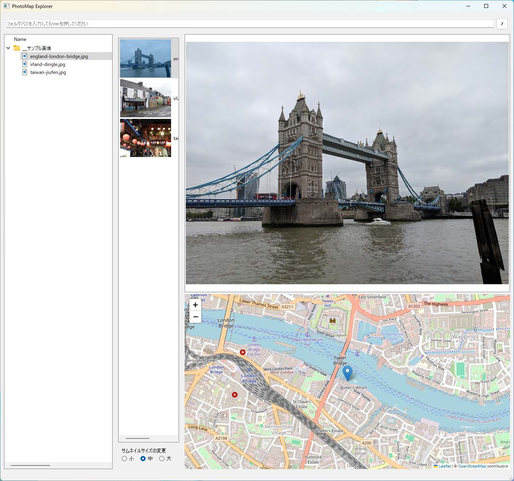

📍 GPS付き画像から撮影地点を地図に自動表示する軽量ツール  
Exif情報を解析し、PyQtWebEngineベースの地図にピンを立てて視覚化します。

---

## 🆕 主な更新（v2.1.2）

### 🌙 ダークモード・ライトモード対応
- **テーマ切り替え機能**: ツールバーのトグルボタンでワンクリック切り替え
- **システム連動**: Windows設定と連動し、起動時に自動でダーク/ライトモードを反映
- **全UI対応**: アドレスバー、サムネイル、プレビュー、マップ等すべての要素がテーマに対応

### 🏗️ Clean Architecture移行完了
- **新UI実装**: 機能的で保守性の高い新しいメインビュー
- **最大化・復元**: 画像/マップビューのダブルクリック最大化機能
- **GIMP風アドレスバー**: キーボードアクセシビリティ対応の直感的ナビゲーション
- **詳細ステータス**: EXIF/GPS情報の統合表示パネル

### 🔧 技術的改善
- Qt起動時の安定性向上（プラットフォームプラグイン自動設定）
- PIL依存廃止、exifreadベースの軽量EXIF処理
- コード品質向上とエラー修正

---

## ✨ 特徴

- **GPS情報の可視化**: ExifのGPS座標を抽出し、インタラクティブな地図に表示
- **ダークモード対応**: システム設定連動の美しいテーマ切り替え
- **直感的操作**: PyQt5による高機能GUI、ダブルクリック最大化
- **GIMP風ナビゲーション**: アドレスバーでの直接パス入力とブレッドクラム表示
- **詳細情報表示**: 撮影日時、カメラ情報、GPS座標等の統合ステータス
- **サムネイル管理**: サイズ変更（大・中・小）と表示順序のカスタマイズ
- **高い保守性**: Clean Architectureによるモジュール化設計

---

## 🖼️ スクリーンショット

画像内のGPS情報を地図にマッピング：



---

## 🚀 セットアップと使い方

### 1. クローン & 仮想環境の作成

```bash
git clone https://github.com/scottlz0310/photomap-explorer.git
cd photomap-explorer
python -m venv venv
```

### 2. 仮想環境を有効化

- Windows:
  ```pwsh
  venv\Scripts\activate
  ```
  ```bash
  source venv\Scripts\activate
  ```
- macOS / Linux:
  ```bash
  source venv/bin/activate
  ```

### 3. 必要なライブラリをインストール

```bash
pip install -r requirements.txt
```

### 4. アプリを起動

```bash
python main.py
```

画像ファイルを選択すると、自動でGPS位置が取得され、地図上にピンが表示されます。

---

## 📦 主な依存ライブラリ

| ライブラリ   | 用途             |
|--------------|------------------|
| PyQt5        | GUI表示          |
| PyQtWebEngine| 地図の描画       |
| folium       | 地図HTML生成     |
| exifread     | Exifデータ抽出   |

---

## 📁 ディレクトリ構成（分割後）

```
photomap-explorer/
├── LICENSE                  #  ライセンスファイル
├── README.md                #  プロジェクト説明・セットアップ手順
├── requirements.txt         #  必要な依存ライブラリ一覧
├── main.py                  #  アプリのエントリーポイント
├── main_window.py           #  メインウィンドウの統括クラス
├── logic/                   #  画像・GPS・地図関連のロジック
│   └── image_utils.py       #  画像処理・GPS抽出・地図生成関数
├── ui/                      #  ユーザーインターフェース部品
│   ├── controls.py          #  アドレスバー・ボタン等のコントロール
│   ├── folder_browser.py    #  フォルダ選択ビュー
│   ├── folder_panel.py      #  フォルダパネル（ツリー表示）
│   ├── image_preview.py     #  画像プレビュー表示
│   ├── map_panel.py         #  地図パネル
│   ├── map_view.py          #  地図ビュー
│   ├── preview_panel.py     #  プレビューパネル
│   ├── thumbnail_panel.py   #  サムネイルパネル
│   └── thumbnail_list.py    #  サムネイルリスト管理
├── assets/                  #  静的ファイル・アイコン等
│   ├── pme.ico              #  アプリ用アイコン
│   └── ...                  #  その他アセット
├── docs/                    #  ドキュメント類
│   ├── architecture.md      #  アーキテクチャ概要
│   ├── CONTRIBUTING.md      #  コントリビュートガイド
│   ├── Pending_features.md  #  開発予定・ToDo
│   └── ...                  #  その他ドキュメント
```

---

## ⚠️ 注意点・制限事項

- GPS情報のない画像は地図に表示されません（アプリは正常動作）
- 一部スマートフォン画像は位置情報が非標準形式で保存されており、読み取れない場合があります
- 現在は1枚ずつの表示に対応（将来的にバッチ処理や複数ピン対応も検討）

### 📋 既知の問題

詳細は [docs/KNOWN_ISSUES.md](docs/KNOWN_ISSUES.md) を参照してください：
- **GIMP風アドレスバー**: 長いパスでの幅制約による表示制限
- **フォルダ選択ダイアログ**: Windows標準ダイアログの仕様制限

### 🔄 今後の開発予定

詳細・進捗は [docs/Pending_features.md](docs/Pending_features.md) を参照

---

## 📄 ライセンス

MIT License  
© 2025 scottlz0310

---

## 🙌 クレジット

開発・ドキュメント: scottlz0310（GitHub: [@scottlz0310](https://github.com/scottlz0310))  
コーディングサポート: Microsoft Copilot
