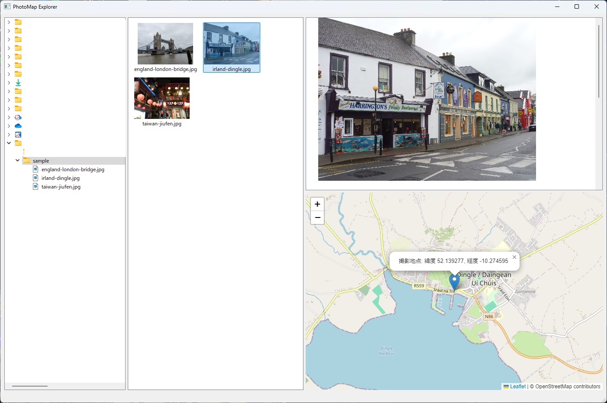

📍 GPS付き画像から、撮影地点を地図に自動表示する軽量ツール  
Exif 情報を解析して、Leaflet.js ベースの地図にピンを立てて視覚化します。
単なる画像ビューワーとしても使えます。

---

## ✨ 特徴

- Exif に埋め込まれた GPS 情報を抽出（緯度・経度）
- Leaflet.js によりインタラクティブな地図を HTML 表示
- PyQt5 GUI により、画像 + 地図ビューアを直感的に操作可能
- 前後の画像履歴ナビゲーション（フォルダ内自動検出）
- GPS情報がない画像も gracefully スキップ処理
- シンプルかつ高速なファイル単体処理

---

## 🖼️ スクリーンショット

画像内のGPS情報を地図にマッピング：



---

## 🚀 セットアップと使い方（Usage）

### 1. クローン & 仮想環境の作成

```bash
git clone https://github.com/scottlz0310/photomap-explorer.git
cd photomap-explorer
python -m venv venv
```

### 2. 仮想環境を有効化

- Windows:
  ```bash
  venv\Scripts\activate
  ```

- macOS / Linux:
  ```bash
  source venv/bin/activate
  ```

### 3. 必要なライブラリをインストール

```bash
pip install -r requirements.txt
```

### 4. アプリを起動

```bash
python main.py
```

画像ファイルを選択すると、自動でGPS位置が取得され、地図上にピンが表示されます。

---

## 📦 主な依存ライブラリ

| ライブラリ | 用途 |
|------------|------|
| PyQt5      | GUI表示 |
| Pillow     | Exifデータの抽出 |
| jinja2     | HTMLテンプレートの生成 |
| Leaflet.js | 地図の描画（CDN経由で読み込み） |

---

## 📁 ディレクトリ構成

```
photomap_explorer/
├── main.py                # エントリーポイント
├── main_window.py         # MainWindowの統括（最低限）
├── README.md
├── requirements.txt       # 依存ライブラリ一覧
│
├── ui/                    # UI関連モジュール
│   ├── __init__.py
│   ├── image_preview.py   # ImagePreviewView クラス
│   ├── folder_browser.py  # QTreeView/Model の構成や選択処理
│   ├── thumbnail_list.py  # QListWidget サムネイル処理
│   ├── map_view.py        # QWebEngineView の地図ビュー管理
│   └── controls.py        # アドレスバー・ボタンのUI部品
│
├── logic/                 # ロジック関連
│   ├── __init__.py
│   ├── image_loader.py
│   ├── gps_parser.py
│   └── map_generator.py
│
└── assets/                # アセット
    └── pme.ico
```

---

## ⚠️ 注意点・既知の制限・今後の開発予定

- GPS 情報のない画像は地図には表示されません（ただしアプリは正常動作）
- 一部のスマートフォン画像では位置情報が非標準形式で保存されており、読み取れない場合があります
- 現在は 1 枚ずつの表示に対応（将来的にはバッチ処理や複数ピンにも対応予定）
- 更新予定は　docs/Pending_features.md　を参照

---

## 📄 ライセンス

MIT License  
© 2025 scottlz0310

---

## 🙌 クレジット

開発・ドキュメント: scottlz0310（GitHub: [@scottlz0310](https://github.com/scottlz0310))  
コーディングサポート: Microsoft Copilot
