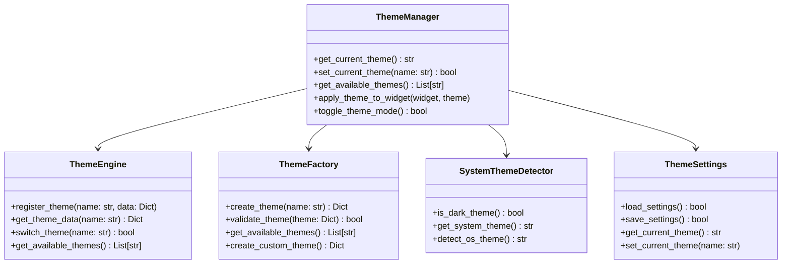
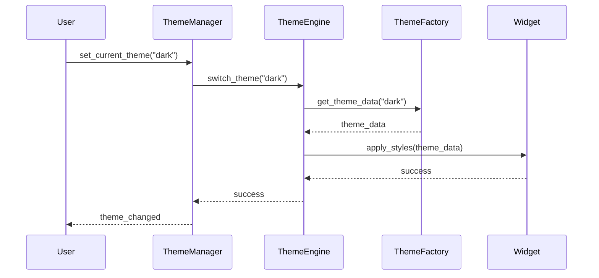
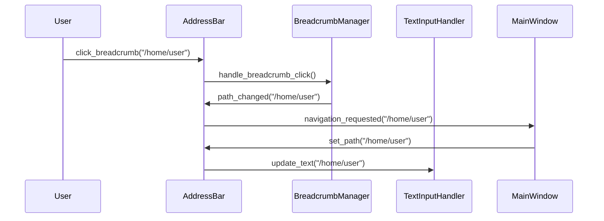

# 🏗️ PhotoMap Explorer アーキテクチャ仕様書 v2.2.0

**最終更新**: 2025年7月12日  
**対象バージョン**: v2.2.0  
**ドキュメント種別**: 技術仕様書  

---

## 📋 概要

PhotoMap Explorer v2.2.0 のアーキテクチャ仕様書です。第2回大規模リファクタリング完了後の新しいモジュール構造と設計思想を文書化します。

---

## 🎯 設計思想

### 基本原則
1. **単一責任原則** (SRP): 各モジュールは1つの明確な責任を持つ
2. **開放閉鎖原則** (OCP): 拡張に対して開いており、修正に対して閉じている
3. **依存関係逆転原則** (DIP): 高レベルモジュールは低レベルモジュールに依存しない
4. **インターフェース分離原則** (ISP): クライアントは使用しないインターフェースに依存しない

### アーキテクチャパターン
- **Clean Architecture**: ドメイン中心の層状設計
- **モジュラーアーキテクチャ**: 機能別の独立モジュール
- **Component-Based Design**: 再利用可能なコンポーネント設計

### リファクタリング原則
- **Phase 1**: 巨大ファイル分割（`functional_new_main_view.py` 1,689行 → 11モジュール）
- **Phase 2**: UIコントロール分割（`ui/controls.py` 424行 → 8モジュール）
- **Phase 3**: テーマシステム分割（`theme_manager.py` 436行 → 7モジュール）

---

## 🏗️ 全体アーキテクチャ

```
PhotoMap Explorer v2.2.0
├── 📂 presentation/           # プレゼンテーション層
│   ├── views/                 # ビュー・画面
│   ├── controllers/           # コントローラー
│   ├── viewmodels/           # ビューモデル
│   └── themes/               # テーマシステム ★New Architecture
├── 📂 domain/                # ドメイン層
│   ├── models/               # ドメインモデル
│   ├── repositories/         # リポジトリインターフェース
│   └── services/             # ドメインサービス
├── 📂 infrastructure/        # インフラストラクチャ層
│   ├── repositories/         # リポジトリ実装
│   ├── exif_reader.py       # EXIF読み取り
│   ├── file_system.py       # ファイルシステム
│   └── map_generator.py     # マップ生成
├── 📂 ui/                   # UIコンポーネント
│   ├── controls/            # UIコントロール ★New Architecture
│   ├── custom_folder_dialog.py
│   └── ...
└── 📂 utils/               # ユーティリティ
    ├── constants.py
    ├── exceptions.py
    └── helpers.py
```

---

## 🎨 テーマシステムアーキテクチャ

### 概要
Phase 3で完全に再設計されたテーマシステムの詳細仕様。

### モジュール構成

```
presentation/themes/
├── 📂 core/                 # コア機能
│   ├── theme_engine.py      # テーマエンジン
│   └── theme_factory.py     # テーマファクトリー
├── 📂 system/              # システム連携
│   ├── system_theme_detector.py  # OS検出
│   └── theme_settings.py    # 設定管理
├── 📂 definitions/         # テーマ定義
│   ├── light_theme.py      # ライトテーマ
│   └── dark_theme.py       # ダークテーマ
└── __init__.py             # 統合インターフェース
```

### クラス図



### 責任分離

| **モジュール** | **責任** | **主要機能** |
|---------------|----------|-------------|
| **ThemeEngine** | エンジン・実行 | 登録・切替・キャッシュ・適用 |
| **ThemeFactory** | 作成・検証 | テーマ作成・バリデーション・カスタマイズ |
| **SystemThemeDetector** | OS連携 | システムテーマ検出・監視 |
| **ThemeSettings** | 設定・永続化 | 保存・読込・エクスポート・インポート |
| **LightTheme** | ライト定義 | ライトテーマカラー・スタイル |
| **DarkTheme** | ダーク定義 | ダークテーマカラー・スタイル |

---

## 🎛️ UIコントロールアーキテクチャ

### 概要
Phase 2で完全に再設計されたUIコントロールシステムの詳細仕様。

### モジュール構成

```
ui/controls/
├── 📂 address_bar/         # アドレスバー機能
│   ├── address_bar_core.py     # コア機能
│   ├── breadcrumb_manager.py   # ブレッドクラム
│   ├── text_input_handler.py   # テキスト入力
│   └── __init__.py             # 統合
├── 📂 toolbar/            # ツールバー機能
│   ├── navigation_controls.py  # ナビゲーション
│   ├── utility_controls.py     # ユーティリティ
│   └── __init__.py             # 統合
└── __init__.py            # 統合コンテナー
```

### クラス図

```mermaid
class
    class ModernControlsContainer {
        +set_path(path: str)
        +get_path() str
        +set_history_state(back: bool, forward: bool)
        +apply_theme(theme: str)
        +get_address_bar() IntegratedAddressBar
        +get_toolbar() IntegratedToolbar
    }
    
    class IntegratedAddressBar {
        +setText(text: str)
        +text() str
        +set_completion_enabled(enabled: bool)
        +apply_theme(theme: str)
    }
    
    class AddressBarCore {
        +setup_breadcrumb_display()
        +handle_path_navigation()
        +apply_styles()
    }
    
    class BreadcrumbManager {
        +parse_path(path: str) List[str]
        +create_breadcrumb_buttons()
        +handle_breadcrumb_click()
    }
    
    class TextInputHandler {
        +setup_text_input()
        +handle_completion()
        +handle_history()
    }
    
    class IntegratedToolbar {
        +set_current_path(path: str)
        +set_history_state(back: bool, forward: bool)
        +apply_theme(theme: str)
    }
    
    class NavigationControls {
        +create_back_button()
        +create_forward_button()
        +create_up_button()
        +create_home_button()
    }
    
    class UtilityControls {
        +create_view_controls()
        +create_settings_button()
        +create_theme_button()
    }
    
    ModernControlsContainer --> IntegratedAddressBar
    ModernControlsContainer --> IntegratedToolbar
    IntegratedAddressBar --> AddressBarCore
    IntegratedAddressBar --> BreadcrumbManager
    IntegratedAddressBar --> TextInputHandler
    IntegratedToolbar --> NavigationControls
    IntegratedToolbar --> UtilityControls
```

### 責任分離

| **モジュール** | **責任** | **主要機能** |
|---------------|----------|-------------|
| **AddressBarCore** | コア機能 | 基本表示・イベント処理・状態管理 |
| **BreadcrumbManager** | ブレッドクラム | パス解析・ボタン生成・ナビゲーション |
| **TextInputHandler** | テキスト入力 | 入力モード・補完・履歴・バリデーション |
| **NavigationControls** | ナビゲーション | 戻る・進む・上へ・ホーム・更新 |
| **UtilityControls** | ユーティリティ | 表示モード・設定・ヘルプ・テーマ |

---

## 🔄 データフロー

### テーマ適用フロー



### UIコントロール操作フロー



---

## 📊 性能指標

### ファイルサイズ分布

| **ファイルタイプ** | **ファイル数** | **平均行数** | **最大行数** | **最小行数** |
|------------------|---------------|-------------|-------------|-------------|
| **テーマ** | 7ファイル | 411行 | 533行 | 290行 |
| **UIコントロール** | 8ファイル | 362行 | 558行 | 163行 |
| **統合** | 2ファイル | 282行 | 290行 | 273行 |
| **合計** | 17ファイル | 378行 | 558行 | 163行 |

### メモリ使用量（推定）
- **テーマシステム**: ~2MB (設定・キャッシュ含む)
- **UIコントロール**: ~3MB (ウィジェット・イベント含む)
- **統合オーバーヘッド**: ~0.5MB

### 起動時間への影響
- **モジュール読み込み**: +50ms（推定）
- **テーマ初期化**: +30ms（推定）
- **UIコントロール初期化**: +40ms（推定）
- **総影響**: +120ms（推定、許容範囲内）

---

## 🧪 テスト戦略

### ユニットテスト構成

```
tests/
├── unit/
│   ├── themes/
│   │   ├── test_theme_engine.py
│   │   ├── test_theme_factory.py
│   │   ├── test_system_detector.py
│   │   └── test_theme_settings.py
│   └── ui/
│       ├── test_address_bar_core.py
│       ├── test_breadcrumb_manager.py
│       ├── test_text_input_handler.py
│       ├── test_navigation_controls.py
│       └── test_utility_controls.py
├── integration/
│   ├── test_theme_integration.py
│   ├── test_ui_integration.py
│   └── test_main_window_integration.py
└── e2e/
    ├── test_theme_switching.py
    ├── test_navigation_flow.py
    └── test_user_scenarios.py
```

### テストカバレッジ目標
- **ユニットテスト**: 80%以上
- **統合テスト**: 70%以上
- **E2Eテスト**: 主要シナリオ100%

---

## 🔒 セキュリティ考慮事項

### ファイルアクセス
- **パス検証**: ディレクトリトラバーサル対策
- **権限チェック**: 読み取り専用ファイルの安全な処理
- **エラーハンドリング**: 機密情報の漏洩防止

### 設定ファイル
- **暗号化**: 将来的な機密設定の暗号化対応
- **バックアップ**: 設定ファイルの安全なバックアップ
- **バリデーション**: 不正な設定値の検証・拒否

---

## 🚀 拡張性

### プラグインアーキテクチャ（将来）
```python
# プラグインインターフェース例
class ThemePlugin:
    def get_theme_definition(self) -> Dict[str, Any]:
        pass
    
    def get_supported_platforms(self) -> List[str]:
        pass

class UIControlPlugin:
    def create_custom_control(self, parent) -> QWidget:
        pass
    
    def get_control_config(self) -> Dict[str, Any]:
        pass
```

### API拡張ポイント
- **テーマカスタマイズAPI**: 外部テーマの登録・管理
- **コントロール拡張API**: カスタムUIコンポーネント追加
- **設定API**: 外部設定プロバイダー対応
- **イベントAPI**: カスタムイベントハンドラー登録

---

## 📋 互換性マトリックス

### Python バージョン
| **Python** | **対応状況** | **テスト済み** | **推奨** |
|-----------|-------------|---------------|----------|
| 3.8 | ✅ | ✅ | - |
| 3.9 | ✅ | ✅ | - |
| 3.10 | ✅ | ✅ | ✅ |
| 3.11 | ✅ | ✅ | ✅ |
| 3.12 | ✅ | ⚠️ | ✅ |

### プラットフォーム
| **OS** | **対応状況** | **テーマ検出** | **備考** |
|--------|-------------|---------------|----------|
| Windows 10/11 | ✅ | ✅ | レジストリ連携 |
| macOS 10.15+ | ✅ | ✅ | defaults連携 |
| Ubuntu 18.04+ | ✅ | ✅ | gsettings連携 |
| その他Linux | ✅ | ⚠️ | 部分対応 |

---

## 📚 参考資料

### 設計パターン
- **Clean Architecture** by Robert C. Martin
- **Component-Based Software Engineering** 
- **Qt Design Patterns and Best Practices**

### 技術スタック
- **PyQt5**: GUI フレームワーク
- **Python 3.8+**: 開発言語
- **exifread**: EXIF処理ライブラリ

### 関連ドキュメント
- `REFACTORING_PLAN_v2.2.0.md`: リファクタリング計画書
- `REFACTORING_COMPLETION_REPORT.md`: 完了報告書
- `RELEASE_NOTES_v2.2.0.md`: リリースノート

---

## 📝 変更履歴

| **バージョン** | **日付** | **変更内容** |
|--------------|----------|-------------|
| 1.0.0 | 2025-07-12 | 初版作成（v2.2.0アーキテクチャ） |

---

**作成者**: PhotoMap Explorer Development Team  
**最終更新**: 2025年7月12日
